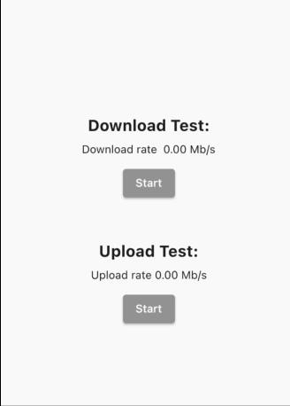

# speed_test_dart

Forked from [speed_test_port](https://pub.dev/packages/speed_test_port)

Flutter package to test ping, upload, download using speedtest.net

## Optimizations

Some refactors, more customization and better error handling. Now the test are done from a server
list and if one server fails, it will try the next one.

## Installation

Add the package to your dependencies:

```yaml
dependencies:
  speed_test_dart: ^1.0.0
```

Finally, run `dart pub get` to download the package.

Projects using this library should use the stable channel of Flutter

### Startup

At the startup of the app, we need to get the best servers to do the test (see `setBestServers`
function). It's recommended to disabled the buttons while this operation is happening:



### Download Speed

Doing download test:


### Upload Speed

Doing upload test:


## Example of usage

```dart
    // Create a tester instance
    SpeedTestDart tester = SpeedTestDart();

    // And a variable to store the best servers
    List<Server> bestServersList = [];

    // Example function to set the best servers, could be called
    // in an initState()
    Future<void> setBestServers() async {
      final settings = await tester.getSettings();
      final servers = settings.servers;

      final _bestServersList = await tester.getBestServers(
        servers: servers,
      );

      setState(() {
        bestServersList = _bestServersList;
      });
    }

    //Test download speed in MB/s
    final downloadRate =
        await tester.testDownloadSpeed(servers: bestServersList);

    //Test upload speed in MB/s
    final uploadRate = await tester.testUploadSpeed(servers: bestServersList);
```
